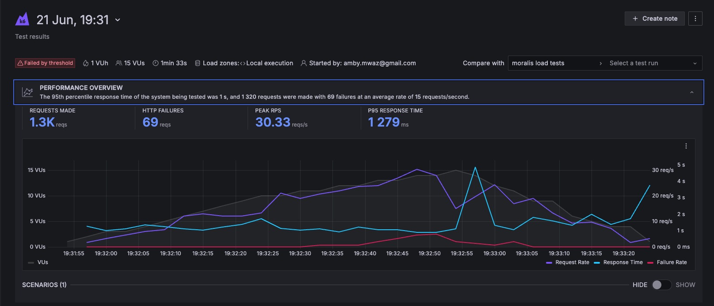

# k6 Load Tests

To run the load tests using k6, follow these steps:

1. **Install k6**: If you haven't already installed k6 on your machine, you can do so from [k6.io](https://k6.io).

## Setup

2. **Clone the repository:**

    ```sh
    git clone git@github.com:mwaz/moralis-technical.git
    cd moralis-technical
    ```

3. **Install dependencies:**

    ```bash
    cd k6-load-tests;
    npm install;
    ```

4. **Create a Moralis account:**
    - Go to [Moralis Admin](https://admin.moralis.io/).
    - Create an account or log in if you already have one.

5. **Create a Node:**
    - Log in to the Moralis Admin UI.
    - Navigate to the Node section and create a new node.
    - Copy the Node API Key for your use. (This can be re-created, however the copied one is for verification purposes on a tool like Postman)

6. **Set Environment Variables**: Modify `environmentConfig.js` in the root directory with your credentials, this include: `MORALIS_ADMIN_EMAIL`, `MORALIS_ADMIN_PASSWORD`, `NODE_API_KEY` and moralis `API_KEY`. These credentials are obtained from step 3 and 4 above.

7. **Run Load Tests Locally**:

   ```bash
   k6 run load-tests.js
   ```

8. **Run Load Tests on Locally but with Cloud Analysis**:

   ```bash
    k6 login cloud --token <your-k6-cloud-api-token>
    ## A login to the cloud is required before executing cloud tests locally with cloud analysis

    k6 cloud load-tests.js 
   ```

## Load Test Metrics

The load tests are run on k6 Cloud, and Metrics such as response times, throughput, and error rates are collected and analyzed.

## Load Tests Overview

The following tests are included in the `load-tests.js` test file:

- **GET / Get NFTs from a wallet address**
  - Simulates fetching NFTs associated with a given wallet address.

- **POST / Get blockNumber from a Node**
  - Simulates retrieving the block number from a blockchain node.

- **POST / Get block by number from a Node**
  - Simulates fetching a specific block from a blockchain node based on its number.

- **POST / Get transaction by a hash from a Node**
  - Simulates fetching a transaction from a blockchain node using its hash.

Each test measures the performance and scalability of the respective endpoint under simulated load conditions, in our case a maximum of `15` virtual users, ramping up from `10` virtual users and then going back to `0` virtual users

## NB

- Adjust the environment variables in `environmentConfig.js` to match your specific environment before running the tests.
- Ensure you have valid credentials and permissions for the Moralis and Node APIs used in the tests.

## Load Testing Summary



The load test in this specific case involved 1,320 requests with a 95th percentile response time of 1 second, resulting in 69 failures at an average rate of 15 requests per second. The detailed metrics for three endpoints are summarized below:

### Detailed Metrics

| Endpoint                                                                                         | Method | Status | Count | Min Response Time | Avg Response Time | Std Dev | P95 Response Time | Max Response Time |
|--------------------------------------------------------------------------------------------------|--------|--------|-------|-------------------|-------------------|---------|-------------------|-------------------|
| [https://site1.moralis-nodes.com/eth/7158cda32f6c4e089465b70825facb6e](https://site1.moralis-nodes.com/eth/7158cda32f6c4e089465b70825facb6e) | POST   | 200    | 987   | 244 ms            | 524 ms            | 578 ms  | 1 s               | 6 s               |
| /api/v2.2/0xff3879b8a363aed92a6eaba8f6f1a96a9ec3c1e/nft                                           | GET    | 200    | 264   | 626 ms            | 904 ms            | 184 ms  | 1 s               | 2 s               |
| [https://site1.moralis-nodes.com/eth/7158cda32f6c4e089465b70825facb6e](https://site1.moralis-nodes.com/eth/7158cda32f6c4e089465b70825facb6e) | POST   | 429    | 69    | 218 ms            | 230 ms            | 23 ms   | 240 ms            | 412 ms            |

### Key Findings

1. **Successful Requests**: The majority of POST requests to the endpoint had moderate response times but with high consistency in returned results.
2. **Consistent GET Requests**: The GET requests had consistent performance with lower variability in response times.
